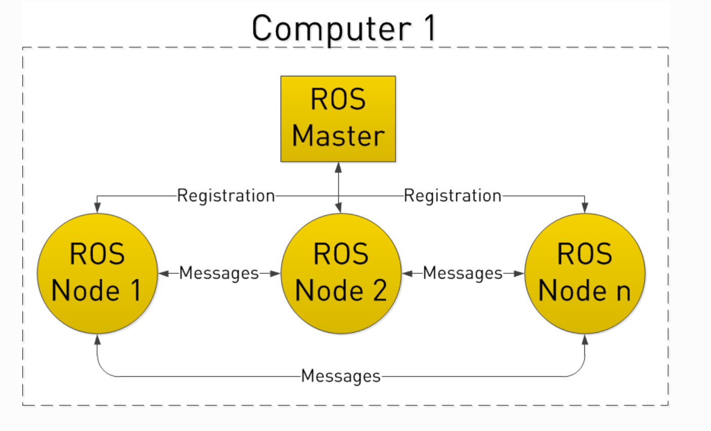
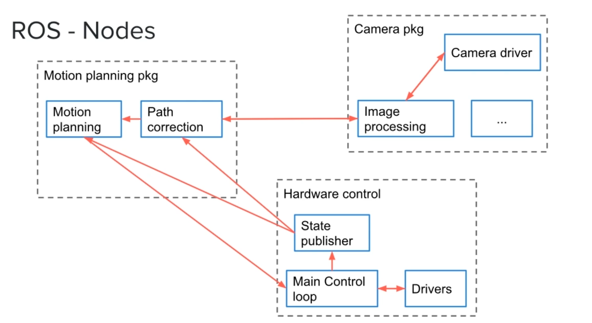
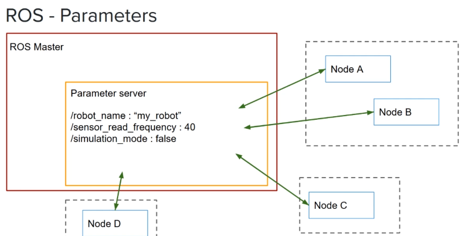
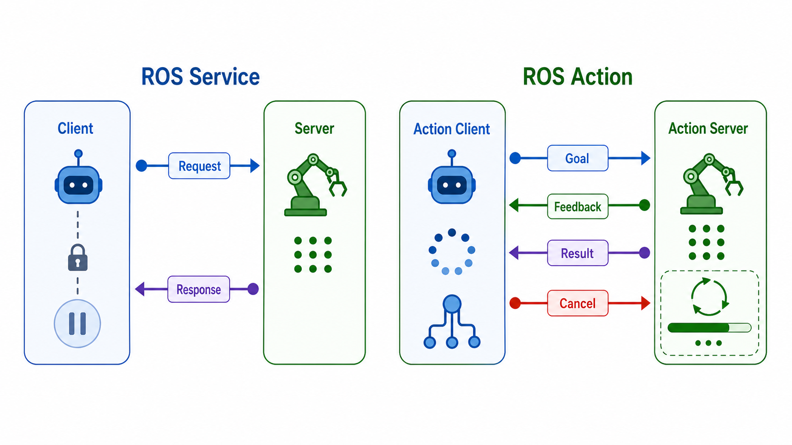

# ROS 1

Concise ROS 1 / Noetic notes for this catkin workspace.

- [ROS 1](#ros-1)
  - [1. Concepts](#1-concepts)
    - [1.1. Core Architecture](#11-core-architecture)
    - [1.2. Catkin](#12-catkin)
    - [1.3. Nodes](#13-nodes)
    - [1.4. Params](#14-params)
    - [1.5. Launch](#15-launch)
    - [1.6. Bags](#16-bags)
  - [2. Quick Start](#2-quick-start)
    - [2.1. Create Workspace and Package](#21-create-workspace-and-package)
    - [2.2. Build and Source](#22-build-and-source)
    - [2.3. Run Nodes](#23-run-nodes)
    - [2.4. Inspect ROS](#24-inspect-ros)
  - [3. Communication](#3-communication)
    - [3.1. Pub/Sub (Topic)](#31-pubsub-topic)
      - [Python](#python)
      - [C++](#c)
      - [Message Types](#message-types)
      - [Custom Message](#custom-message)
      - [Inspect Topics](#inspect-topics)
      - [Anonymous Nodes](#anonymous-nodes)
    - [3.2. Client-Server (Service)](#32-client-server-service)
      - [Service Type](#service-type)
      - [Server](#server)
      - [Client](#client)
      - [Build and Source](#build-and-source)
  - [3.3. Action](#33-action)
    - [Package Convention](#package-convention)
    - [Message Format](#message-format)
    - [Client/Server](#clientserver)
  - [4. Questions/Issues](#4-questionsissues)
    - [`rosrun` cannot find a node](#rosrun-cannot-find-a-node)
    - [`/usr/bin/env: 'python': No such file or directory`](#usrbinenv-python-no-such-file-or-directory)
    - [VS Code cannot find `<ros/ros.h>`](#vs-code-cannot-find-rosrosh)
    - [`sudo: unable to resolve host noetic`](#sudo-unable-to-resolve-host-noetic)
    - [Is it okay to skip `roscpp`? Will `CMakeLists.txt` still be needed?](#is-it-okay-to-skip-roscpp-will-cmakeliststxt-still-be-needed)


## 1. Concepts
### 1.1. Core Architecture



- **ROS Master**: registry where nodes find each other. Started by `roscore`.
- **roscore**: starts the master, parameter server, and `/rosout`.
- **Package**: unit of ROS code distribution. Contains nodes, dependencies, build config, messages, services, and launch files.
- **Node**: one running process in the ROS graph. Nodes register with the master, then communicate directly.
- **Topic**: named publish/subscribe message stream.
- **Service**: request/response call.
- **Parameter**: runtime config stored on the parameter server.

`roscore` usually listens on port `11311`. Nodes also expose XML-RPC URIs on dynamic ports, so seeing a random port such as `39625` is normal.

### 1.2. Catkin
Catkin is the ROS 1 build system.

```text
workspace/
  src/
    package_name/
      package.xml
      CMakeLists.txt
      scripts/
      src/
  build/
  devel/
```

- `package.xml`: package metadata and dependencies.
- `CMakeLists.txt`: build rules for C++ nodes, Python scripts, messages, services, and libraries.
- `devel/setup.zsh`: generated environment setup file.

### 1.3. Nodes
  

- Python scripts usually live in `scripts/`, use `#!/usr/bin/env python3`, and must be executable.
- C++ nodes must be added to `CMakeLists.txt`, linked to `${catkin_LIBRARIES}`, and built with `catkin_make`.
- `rosrun` uses the executable name exactly: Python keeps `.py`; compiled C++ usually does not.

### 1.4. Params
  

Params are runtime configuration values stored on the ROS parameter server, which is started by `roscore`.

Use params for settings that nodes read at startup or occasionally during runtime: robot names, speed limits, debug flags, calibration constants, file paths, and feature toggles. Do not use params for high-rate data; use topics for that.

Common CLI usage:

```bash
rosparam list
rosparam set /robot/name steady
rosparam set /robot/max_speed 1.5
rosparam get /robot/name
rosparam get /robot
rosparam delete /robot/max_speed
```

Param names are hierarchical. A leading `/` makes the name absolute:

```text
/robot/name
/robot/max_speed
/camera/exposure
```

Use `/robot` as a namespace/container, then put values under it. Avoid trying to use the same name as both a scalar and a container:

```bash
rosparam set /robot steady        # /robot is a string
rosparam set /robot/speed 1.5     # bad shape: /robot now also needs children
```

Prefer:

```bash
rosparam set /robot/name steady
rosparam set /robot/speed 1.5
```

Read params from Python:

```python
robot_name = rospy.get_param("/robot/name", "unnamed")
max_speed = rospy.get_param("/robot/max_speed", 1.0)

rospy.set_param("/robot/debug", True)
```

Private params use `~` and belong to one node namespace. This is common in reusable nodes:

```python
rate_hz = rospy.get_param("~rate_hz", 10)
```

### 1.5. Launch
Launch files start multiple nodes and set their configuration from one command. They usually live in a package's `launch/` folder and use `.launch` XML files.

Minimal launch file:

```xml
<!-- src/tutorial/launch/robot_status.launch -->
<launch>
  <node pkg="tutorial" type="publisher.py" name="robot_status_publisher" output="screen" />
  <node pkg="tutorial" type="subscriber.py" name="robot_status_subscriber" output="screen" />
</launch>
```

Run it:

```bash
roslaunch tutorial robot_status.launch
```

Practical launch features:

```xml
<launch>
  <arg name="rate_hz" default="2" />

  <param name="/robot/name" value="steady" />
  <param name="/robot/max_speed" value="1.5" />

  <node pkg="tutorial" type="publisher.py" name="robot_status_publisher" output="screen">
    <param name="rate_hz" value="$(arg rate_hz)" />
  </node>

  <node pkg="tutorial" type="subscriber.py" name="robot_status_subscriber" output="screen" />
</launch>
```

Launch concepts:

- `<node>` starts one node from a package.
- `pkg` is the ROS package name.
- `type` is the executable file name for Python scripts, or the compiled executable name for C++ nodes.
- `name` is the ROS graph node name.
- `output="screen"` prints logs to your terminal.
- `<arg>` creates a launch-time variable.
- `<param>` sets a parameter before nodes start.

Override args from the command line:

```bash
roslaunch tutorial robot_status.launch rate_hz:=5
```

Inspect after launching:

```bash
rosnode list
rostopic list
rosparam get /robot/name
```

### 1.6. Bags
Bags record and replay ROS topic traffic. They are useful for debugging, demos, regression testing, and working without the real robot connected.

```bash
# record one topic
rosbag record /robot_status

# record multiple topics
rosbag record /robot_status /rosout

# record everything
rosbag record -a

# choose the output file
rosbag record -O robot_status.bag /robot_status

# inspect a bag
rosbag info robot_status.bag

# replay a bag
rosbag play robot_status.bag

# replay at a different speed
rosbag play -r 0.5 robot_status.bag
rosbag play -r 2.0 robot_status.bag

# loop playback
rosbag play -l robot_status.bag
```

Common workflow:

```bash
# terminal 1
roscore

# terminal 2
source devel/setup.zsh
rosrun tutorial subscriber.py

# terminal 3
source devel/setup.zsh
rosbag play robot_status.bag
```

During playback, ROS republishes the recorded topics. A subscriber does not care whether messages come from the original publisher or from `rosbag play`, as long as the topic name and message type match.

## 2. Quick Start
### 2.1. Create Workspace and Package
```bash
mkdir -p ~/workspace/src
cd ~/workspace
catkin_make
source devel/setup.zsh

cd src
catkin_create_pkg tutorial roscpp rospy std_msgs
```

```text
src/tutorial/
  package.xml
  CMakeLists.txt
  scripts/
```

### 2.2. Build and Source
```bash
# from the workspace root
catkin_make
source devel/setup.zsh
```

Use `setup.zsh` for zsh. Use `setup.bash` for bash.

Re-run `source devel/setup.zsh` when opening a new terminal, after creating a package, or after changing package dependencies/interfaces. Normal node code edits do not usually need re-sourcing.

### 2.3. Run Nodes
```bash
# terminal 1
roscore
```

```bash
# terminal 2
# from this workspace root
source devel/setup.zsh

# Python node
chmod +x src/tutorial/scripts/first_node.py
rosrun tutorial first_node.py

# C++ node
catkin_make
rosrun tutorial second_node
```

```cmake
# src/tutorial/CMakeLists.txt
add_executable(second_node scripts/second_node.cpp)
target_link_libraries(second_node ${catkin_LIBRARIES})
```

### 2.4. Inspect ROS
```bash
# packages
rospack list
rospack find tutorial

# nodes
rosnode list
rosnode info /first_node
```

## 3. Communication
Topics use a publish/subscribe model. Publishers send typed messages to a topic; subscribers register callbacks for messages on that topic.

### 3.1. Pub/Sub (Topic)
#### Python
```python
from std_msgs.msg import String

publisher = rospy.Publisher("chatter_py", String, queue_size=10)
subscriber = rospy.Subscriber("chatter_py", String, callback)

def callback(msg):
    rospy.loginfo(msg.data)
```

#### C++

```cpp
#include <std_msgs/String.h>

ros::NodeHandle nh;  // Creates publishers/subscribers connected to the ROS graph.
ros::Publisher publisher = nh.advertise<std_msgs::String>("chatter_cpp", 10);
ros::Subscriber subscriber = nh.subscribe("chatter_cpp", 10, chatterCallback);

void chatterCallback(const std_msgs::String::ConstPtr& msg) {
    ROS_INFO("%s", msg->data.c_str());
}
```

#### Message Types
Built-in messages come from packages such as `std_msgs`, `geometry_msgs`, and `sensor_msgs`. For example, `std_msgs/String` has one field:

```text
string data
```

Use built-in messages when they already match the data. Define a custom message when the topic has domain-specific fields that should travel together.

#### Custom Message
Custom messages live in `msg/` and use one field per line:

```msg
# src/custom_msgs/msg/RobotStatus.msg
int64 temperature
bool motors_up
string debug_msg
```

ROS generates language-specific types after `catkin_make`:

```python
from custom_msgs.msg import RobotStatus
```

```cpp
#include <custom_msgs/RobotStatus.h>
```

Message rules:

- File names use `CamelCase.msg`; generated type names match the file name.
- Field names use lowercase words with underscores, such as `battery_level`.
- Supported primitive types include `bool`, `int32`, `int64`, `float32`, `float64`, `string`, and `time`.
- Arrays use `type[] name`, such as `float64[] readings`.
- Other messages can be fields, such as `std_msgs/Header header`.

Enable custom message generation:

```cmake
find_package(catkin REQUIRED COMPONENTS message_generation roscpp rospy std_msgs)

add_message_files(FILES RobotStatus.msg)
generate_messages(DEPENDENCIES std_msgs)

catkin_package(CATKIN_DEPENDS message_runtime roscpp rospy std_msgs)
```

```xml
<build_depend>message_generation</build_depend>
<exec_depend>message_runtime</exec_depend>
```

After adding or changing `.msg` files:

```bash
catkin_make
source devel/setup.zsh
```

If another package uses this message, add `custom_msgs` as a dependency for that package:

```cmake
find_package(catkin REQUIRED COMPONENTS roscpp rospy custom_msgs)
catkin_package(CATKIN_DEPENDS roscpp rospy custom_msgs)
```

```xml
<depend>custom_msgs</depend>
```

Use custom messages exactly like built-in messages: import/include the generated type, use it as the topic type, fill its fields, then publish or read those fields in a callback.

Python publisher:

```python
#!/usr/bin/env python3
import rospy
from custom_msgs.msg import RobotStatus

rospy.init_node("robot_status_publisher")
publisher = rospy.Publisher("robot_status", RobotStatus, queue_size=10)
rate = rospy.Rate(1)

while not rospy.is_shutdown():
    msg = RobotStatus()
    msg.temperature = 42
    msg.motors_up = True
    msg.debug_msg = "nominal"

    publisher.publish(msg)
    rate.sleep()
```

Python subscriber:

```python
#!/usr/bin/env python3
import rospy
from custom_msgs.msg import RobotStatus

def callback(msg):
    rospy.loginfo(
        "temperature=%d motors_up=%s debug_msg=%s",
        msg.temperature,
        msg.motors_up,
        msg.debug_msg,
    )

rospy.init_node("robot_status_subscriber")
subscriber = rospy.Subscriber("robot_status", RobotStatus, callback)
rospy.spin()
```

C++ publisher:

```cpp
#include <ros/ros.h>
#include <custom_msgs/RobotStatus.h>

int main(int argc, char** argv) {
  ros::init(argc, argv, "robot_status_publisher");
  ros::NodeHandle nh;
  ros::Publisher publisher = nh.advertise<custom_msgs::RobotStatus>("robot_status", 10);
  ros::Rate rate(1);

  while (ros::ok()) {
    custom_msgs::RobotStatus msg;
    msg.temperature = 42;
    msg.motors_up = true;
    msg.debug_msg = "nominal";

    publisher.publish(msg);
    rate.sleep();
  }
}
```

C++ subscriber:

```cpp
#include <ros/ros.h>
#include <custom_msgs/RobotStatus.h>

void callback(const custom_msgs::RobotStatus::ConstPtr& msg) {
  ROS_INFO(
      "temperature=%ld motors_up=%s debug_msg=%s",
      msg->temperature,
      msg->motors_up ? "true" : "false",
      msg->debug_msg.c_str());
}

int main(int argc, char** argv) {
  ros::init(argc, argv, "robot_status_subscriber");
  ros::NodeHandle nh;
  ros::Subscriber subscriber = nh.subscribe("robot_status", 10, callback);
  ros::spin();
}
```

#### Inspect Topics
```bash
rostopic list
rostopic info /robot_status
rostopic echo /robot_status
rostopic info /chatter_cpp
rostopic echo /chatter_cpp
```

#### Anonymous Nodes
Node names must be unique. If you want to run multiple copies of the same Python node, use `anonymous=True`:

```python
rospy.init_node("publisher", anonymous=True)
```

In C++, use `ros::init_options::AnonymousName`:

```cpp
ros::init(argc, argv, "publisher_cpp", ros::init_options::AnonymousName);
```

### 3.2. Client-Server (Service)
Services use a synchronous request/response model. They fit quick actions where a client asks once and waits for one result, such as adding numbers, resetting state, saving data, or triggering a robot action.

#### Service Type
A `.srv` file defines the request above `---` and the response below it:

```srv
# src/tutorial/srv/AddTwoInts.srv
int64 a
int64 b
---
int64 sum
```

After `catkin_make`, ROS generates:

```python
AddTwoInts          # full service type
AddTwoIntsRequest   # request fields: a, b
AddTwoIntsResponse  # response fields: sum
```

#### Server
One service name is one endpoint. This node exposes `/add_two_ints`:

```python
from tutorial.srv import AddTwoInts, AddTwoIntsResponse

def handle_add_two_ints(req):
    return AddTwoIntsResponse(req.a + req.b)

service = rospy.Service("add_two_ints", AddTwoInts, handle_add_two_ints)
rospy.spin()
```

#### Client
Clients wait for the endpoint, create a proxy, then call it like a function:

```python
from tutorial.srv import AddTwoInts

rospy.wait_for_service("add_two_ints")
add_two_ints = rospy.ServiceProxy("add_two_ints", AddTwoInts)
response = add_two_ints(3, 5)
print(response.sum)
```

#### Build and Source
Custom `.srv` files need message generation:

```cmake
find_package(catkin REQUIRED COMPONENTS message_generation rospy std_msgs)

add_service_files(FILES AddTwoInts.srv)
generate_messages(DEPENDENCIES std_msgs)

catkin_package(CATKIN_DEPENDS message_runtime rospy std_msgs)
```

```xml
<build_depend>message_generation</build_depend>
<exec_depend>message_runtime</exec_depend>
```

After adding or changing `.srv` files:

```bash
catkin_make
source devel/setup.zsh
```

The `source` step matters because generated Python modules such as `tutorial.srv` live under `devel/lib/python3/dist-packages`.

## 3.3. Action
  

(short description on ROS Action. and versus ROS Service, communication is based on topics, get status and feedback on the current goal)
- create a package with `actionlib_msgs` dependency
  - (what does it enable?)
- add `message_generation` exec dependency to package.xml
  - (what does it enable?)

### Package Convention
```bash
root/
  src/
    package/
      action/
        - *.action  # custom action file
```

### Message Format
```bash
# goal
# (what is this for)

---
# result
# (what is this for)

---
# feedback
# (what is this for)
```

then build the action file using `catkin_make`. This will create six(?) variants of action messages.

### Client/Server
```py


```


## 4. Questions/Issues
### `rosrun` cannot find a node
```bash
rosrun tutorial first_node.py   # Python script filename
rosrun tutorial second_node     # C++ executable name
chmod +x src/tutorial/scripts/first_node.py
```

### `/usr/bin/env: 'python': No such file or directory`
```python
#!/usr/bin/env python3
```

### VS Code cannot find `<ros/ros.h>`
ROS include paths come from catkin/CMake, not from the `.cpp` file alone. A C++ file should be bound to a CMake target:

```cmake
add_executable(testone scripts/testone.cpp)
target_link_libraries(testone ${catkin_LIBRARIES})
```

Then rebuild so the IDE/build system sees the target:

```bash
catkin_make -DCMAKE_EXPORT_COMPILE_COMMANDS=ON
```

Then set:

```json
"C_Cpp.default.compileCommands": "${workspaceFolder}/build/compile_commands.json"
```

### `sudo: unable to resolve host noetic`
This is a container hostname warning from `sudo`, not a ROS error. Avoid `sudo` for files owned by your user:

```bash
chmod +x src/tutorial/scripts/first_node.py
```

### VS Code cannot find generated Python message types (e.g. `CountUntilAction`)

Generated Python modules live in `devel/lib/python3/dist-packages/` after `catkin_make`. Pylance needs to know that path:

```json
// .vscode/settings.json
"python.analysis.extraPaths": [
    "${workspaceFolder}/devel/lib/python3/dist-packages",
    "/opt/ros/noetic/lib/python3/dist-packages"
]
```

After adding the path or after any `catkin_make` that generates new types, reload VS Code (`Ctrl+Shift+P` → `Developer: Reload Window`) so Pylance re-indexes the devel directory.

### Is it okay to skip `roscpp`? Will `CMakeLists.txt` still be needed?

- Skipping `roscpp` is fine — Python-only packages are common
- `CMakeLists.txt` is still required; catkin reads it for every package regardless of language
- `roscpp` is worth adding for: high-rate control loops, hardware drivers (C SDKs), real-time kernels, or C++ libraries (Eigen, PCL) that lack Python bindings
