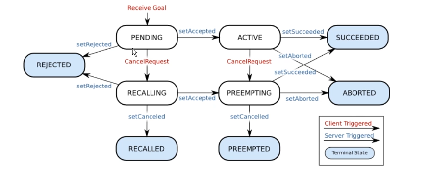

# ROS 1

Concise ROS 1 / Noetic notes for this catkin workspace.

- [ROS 1](#ros-1)
  - [1. Concepts](#1-concepts)
    - [1.1. Core Architecture](#11-core-architecture)
    - [1.2. Catkin](#12-catkin)
    - [1.3. Nodes](#13-nodes)
    - [1.4. Params](#14-params)
    - [1.5. Launch](#15-launch)
    - [1.6. Bags](#16-bags)
  - [2. Quick Start](#2-quick-start)
    - [2.1. Create Workspace and Package](#21-create-workspace-and-package)
    - [2.2. Build and Source](#22-build-and-source)
    - [2.3. Run Nodes](#23-run-nodes)
    - [2.4. Inspect ROS](#24-inspect-ros)
  - [3. Communication](#3-communication)
    - [3.1. Pub/Sub (Topic)](#31-pubsub-topic)
      - [Message Types](#message-types)
      - [Custom Message](#custom-message)
      - [Inspect Topics](#inspect-topics)
      - [Anonymous Nodes](#anonymous-nodes)
    - [3.2. Client-Server (Service)](#32-client-server-service)
      - [Service Type](#service-type)
      - [Server](#server)
      - [Client](#client)
      - [Build and Source](#build-and-source)
    - [3.3. Action](#33-action)
      - [Package Convention](#package-convention)
      - [Message Format](#message-format)
      - [Server/Client](#serverclient)
  - [4. Questions/Issues](#4-questionsissues)
    - [`rosrun` cannot find a node](#rosrun-cannot-find-a-node)
    - [`/usr/bin/env: 'python': No such file or directory`](#usrbinenv-python-no-such-file-or-directory)
    - [`sudo: unable to resolve host noetic`](#sudo-unable-to-resolve-host-noetic)
    - [VS Code cannot find generated Python message types (e.g. `CountUntilAction`)](#vs-code-cannot-find-generated-python-message-types-eg-countuntilaction)


## 1. Concepts
### 1.1. Core Architecture


- **ROS Master**: registry where nodes find each other. Started by `roscore`.
- **roscore**: starts the master, parameter server, and `/rosout`.
- **Package**: unit of ROS code distribution. Contains nodes, dependencies, build config, messages, services, and launch files.
- **Node**: one running process in the ROS graph.
- **Topic**: named publish/subscribe message stream.
- **Service**: synchronous request/response call.
- **Parameter**: runtime config stored on the parameter server.

### 1.2. Catkin
Catkin is the ROS 1 build system.

```text
workspace/
  src/
    package_name/
      package.xml
      CMakeLists.txt
      scripts/
  build/
  devel/
```

- `package.xml`: package metadata and dependencies.
- `CMakeLists.txt`: build rules for nodes, messages, services, and libraries.
- `devel/setup.zsh`: generated environment setup file.

### 1.3. Nodes
  

- Python scripts live in `scripts/`, use `#!/usr/bin/env python3`, and must be executable (`chmod +x`).
- `rosrun` uses the executable name exactly: Python keeps `.py`.

### 1.4. Params
  

Runtime config stored on the parameter server. Use for startup settings (robot names, speed limits, calibration). Not for high-rate data — use topics for that.

```bash
rosparam list
rosparam set /robot/name steady
rosparam get /robot/name
rosparam delete /robot/max_speed
```

Names are hierarchical (`/robot/name`, `/camera/exposure`). A leading `/` is absolute.

```python
robot_name = rospy.get_param("/robot/name", "unnamed")
rospy.set_param("/robot/debug", True)
rate_hz = rospy.get_param("~rate_hz", 10)  # ~ = private, scoped to this node
```

### 1.5. Launch
Launch files start multiple nodes from one command. Live in `launch/`, use `.launch` XML.

```xml
<!-- src/tutorial/launch/robot_status.launch -->
<launch>
  <arg name="rate_hz" default="2" />
  <param name="/robot/name" value="steady" />

  <node pkg="tutorial" type="publisher.py" name="robot_status_publisher" output="screen">
    <param name="rate_hz" value="$(arg rate_hz)" />
  </node>
  <node pkg="tutorial" type="subscriber.py" name="robot_status_subscriber" output="screen" />
</launch>
```

```bash
roslaunch tutorial robot_status.launch
roslaunch tutorial robot_status.launch rate_hz:=5   # override arg
```

- `pkg` / `type` / `name`: package, executable, ROS node name.
- `output="screen"`: log to terminal. `<arg>`: launch-time variable. `<param>`: set before nodes start.

### 1.6. Bags
Record and replay ROS topic traffic for debugging, testing, and offline work.

```bash
rosbag record /robot_status                  # one topic
rosbag record -a -O robot_status.bag         # all topics, named file
rosbag info robot_status.bag
rosbag play robot_status.bag
rosbag play -r 0.5 robot_status.bag          # half speed
rosbag play -l robot_status.bag              # loop
```

## 2. Quick Start
### 2.1. Create Workspace and Package
```bash
mkdir -p ~/workspace/src && cd ~/workspace
catkin_make && source devel/setup.zsh

cd src
catkin_create_pkg tutorial roscpp rospy std_msgs
```

### 2.2. Build and Source
```bash
catkin_make
source devel/setup.zsh
```

Re-source when opening a new terminal or after changing package dependencies/interfaces.

### 2.3. Run Nodes
```bash
# terminal 1
roscore

# terminal 2
source devel/setup.zsh
chmod +x src/tutorial/scripts/first_node.py
rosrun tutorial first_node.py
```

### 2.4. Inspect ROS
```bash
rospack list && rospack find tutorial
rosnode list && rosnode info /first_node
```

## 3. Communication

### 3.1. Pub/Sub (Topic)
```python
from std_msgs.msg import String

publisher = rospy.Publisher("chatter", String, queue_size=10)
subscriber = rospy.Subscriber("chatter", String, callback)

def callback(msg):
    rospy.loginfo(msg.data)
```

#### Message Types
Built-in messages from `std_msgs`, `geometry_msgs`, `sensor_msgs`. Define custom when built-ins don't fit.

#### Custom Message
```msg
# src/custom_msgs/msg/RobotStatus.msg
int64 temperature
bool motors_up
string debug_msg
```

```python
from custom_msgs.msg import RobotStatus
```

Rules: `CamelCase.msg` filename; `snake_case` field names; primitives: `bool`, `int32/64`, `float32/64`, `string`, `time`; arrays: `float64[] readings`.

CMake:
```cmake
find_package(catkin REQUIRED COMPONENTS message_generation rospy std_msgs)
add_message_files(FILES RobotStatus.msg)
generate_messages(DEPENDENCIES std_msgs)
catkin_package(CATKIN_DEPENDS message_runtime rospy std_msgs)
```

```xml
<build_depend>message_generation</build_depend>
<exec_depend>message_runtime</exec_depend>
```

Publisher:
```python
#!/usr/bin/env python3
import rospy
from custom_msgs.msg import RobotStatus

rospy.init_node("robot_status_publisher")
publisher = rospy.Publisher("robot_status", RobotStatus, queue_size=10)
rate = rospy.Rate(1)
while not rospy.is_shutdown():
    msg = RobotStatus()
    msg.temperature = 42
    msg.motors_up = True
    msg.debug_msg = "nominal"
    publisher.publish(msg)
    rate.sleep()
```

Subscriber:
```python
#!/usr/bin/env python3
import rospy
from custom_msgs.msg import RobotStatus

def callback(msg):
    rospy.loginfo("temp=%d motors=%s", msg.temperature, msg.motors_up)

rospy.init_node("robot_status_subscriber")
rospy.Subscriber("robot_status", RobotStatus, callback)
rospy.spin()
```

#### Inspect Topics
```bash
rostopic list
rostopic info /robot_status
rostopic echo /robot_status
```

#### Anonymous Nodes
Node names must be unique. Use `anonymous=True` to run multiple copies:
```python
rospy.init_node("publisher", anonymous=True)
```

### 3.2. Client-Server (Service)
One blocking call → one reply. Use for quick actions: reset state, save data, trigger a robot action.

#### Service Type
```srv
# src/tutorial/srv/AddTwoInts.srv
int64 a
int64 b
---
int64 sum
```

Generates `AddTwoInts`, `AddTwoIntsRequest`, `AddTwoIntsResponse` after `catkin_make`.

#### Server
```python
from tutorial.srv import AddTwoInts, AddTwoIntsResponse

def handle_add_two_ints(req):
    return AddTwoIntsResponse(req.a + req.b)

service = rospy.Service("add_two_ints", AddTwoInts, handle_add_two_ints)
rospy.spin()
```

#### Client
```python
from tutorial.srv import AddTwoInts

rospy.wait_for_service("add_two_ints")
add_two_ints = rospy.ServiceProxy("add_two_ints", AddTwoInts)
response = add_two_ints(3, 5)
print(response.sum)
```

#### Build and Source
```cmake
find_package(catkin REQUIRED COMPONENTS message_generation rospy std_msgs)
add_service_files(FILES AddTwoInts.srv)
generate_messages(DEPENDENCIES std_msgs)
catkin_package(CATKIN_DEPENDS message_runtime rospy std_msgs)
```

```xml
<build_depend>message_generation</build_depend>
<exec_depend>message_runtime</exec_depend>
```

```bash
catkin_make && source devel/setup.zsh
```

### 3.3. Action
  

Actions suit long-running goals where the client needs ongoing feedback and can cancel mid-flight. All communication happens over topics — the call does not block.

vs. Service: one blocking call → one reply; Action: send goal → feedback stream → final result, cancel anytime.

Setup:
- `actionlib_msgs` (build dep): compiles `.action` into 7 message types
- `message_generation` (build dep): enables `add_action_files()` and `generate_messages()` in CMake
- `message_runtime` (exec dep): runtime message classes
- `actionlib` (exec dep): `ActionServer` / `ActionClient` API

The 5 action topics (auto-created under the action name):
```bash
rostopic echo /count_until/goal      # client → server: new goals
rostopic echo /count_until/cancel    # client → server: cancel requests
rostopic echo /count_until/status    # server → client: goal state per goal
rostopic echo /count_until/feedback  # server → client: progress stream
rostopic echo /count_until/result    # server → client: final result
```

#### Package Convention
```text
src/
  package/
    action/
      CountUntil.action
```

#### Message Format
```bash
# goal — what the client asks the server to do
int64 max_number
float64 wait_duration
---
# result — returned once when the goal finishes (success, abort, or preempt)
int64 count
---
# feedback — streamed repeatedly while the goal is active
float64 percentage
```

`catkin_make` generates **7 message types** from one `.action` file:
- `CountUntilGoal`, `CountUntilResult`, `CountUntilFeedback` — payload types (fill these yourself)
- `CountUntilActionGoal`, `CountUntilActionResult`, `CountUntilActionFeedback` — stamped protocol wrappers (used internally)
- `CountUntilAction` — combined spec passed to `ActionServer` / `ActionClient`

CMake and `package.xml`:
```cmake
find_package(catkin REQUIRED COMPONENTS actionlib_msgs message_generation rospy std_msgs)
add_action_files(FILES CountUntil.action)
generate_messages(DEPENDENCIES actionlib_msgs std_msgs)
catkin_package(CATKIN_DEPENDS actionlib_msgs message_runtime rospy std_msgs)
```

```xml
<build_depend>actionlib_msgs</build_depend>
<build_depend>message_generation</build_depend>
<exec_depend>actionlib_msgs</exec_depend>
<exec_depend>message_runtime</exec_depend>
```

#### Server/Client
  

Server:
```python
self.server = actionlib.ActionServer('count_until', CountUntilAction, execute_cb=self.execute)
self.server.start()

def execute(self, goal):
    # goal.max_number, goal.wait_duration
    feedback = CountUntilFeedback(); feedback.percentage = 50.0
    self.server.publish_feedback(feedback)
    if self.server.is_preempt_requested(): self.server.set_preempted()
    result = CountUntilResult(); result.count = counter
    self.server.set_succeeded(result)   # or set_aborted(result)
```

Client:
```python
self.client = actionlib.ActionClient('count_until', CountUntilAction)
self.client.wait_for_server()

# send goal
goal = CountUntilGoal(); goal.max_number = 5; goal.wait_duration = 1.0
self.client.send_goal(goal, done_cb=self.on_done, feedback_cb=self.on_feedback)

def on_done(self, status, result): ...      # status: GoalStatus int
def on_feedback(self, feedback): ...        # feedback.percentage

# cancel
self.client.cancel_all_goals()
```

GoalStatus values (`actionlib_msgs/GoalStatus`):

| value | name | meaning |
|---|---|---|
| 0 | PENDING | received, not yet processed |
| 1 | ACTIVE | being executed |
| 2 | PREEMPTED | cancelled while active |
| 3 | SUCCEEDED | completed successfully |
| 4 | ABORTED | server terminated the goal internally |
| 8 | RECALLED | cancelled before becoming active |

## 4. Questions/Issues
### `rosrun` cannot find a node
```bash
rosrun tutorial first_node.py
chmod +x src/tutorial/scripts/first_node.py
```

### `/usr/bin/env: 'python': No such file or directory`
```python
#!/usr/bin/env python3
```

### `sudo: unable to resolve host noetic`
Container hostname warning from `sudo`, not a ROS error. Use `chmod +x` instead of `sudo` for script permissions.

### VS Code cannot find generated Python message types (e.g. `CountUntilAction`)

Generated modules live in `devel/lib/python3/dist-packages/` after `catkin_make`. Add to Pylance:

```json
// .vscode/settings.json
"python.analysis.extraPaths": [
    "${workspaceFolder}/devel/lib/python3/dist-packages",
    "/opt/ros/noetic/lib/python3/dist-packages"
]
```

After adding or after `catkin_make` generates new types, reload VS Code (`Ctrl+Shift+P` → `Developer: Reload Window`).
